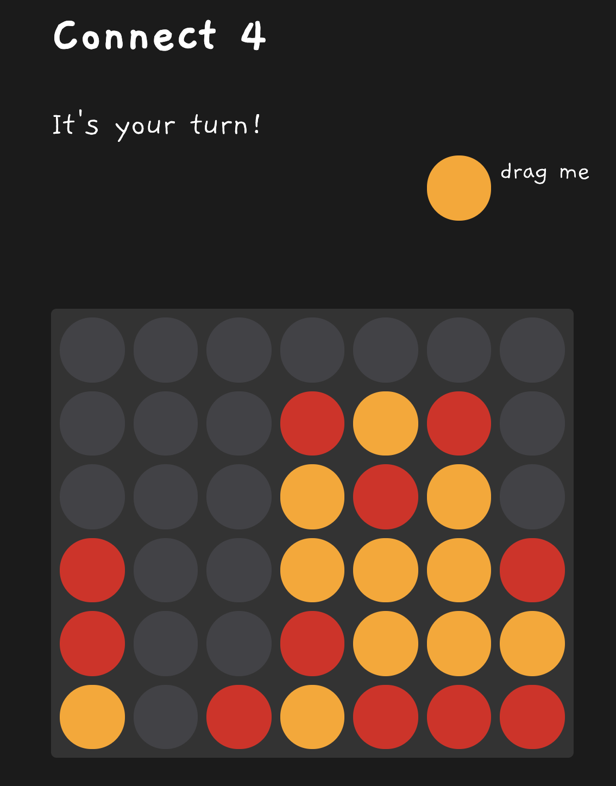

# Connect 4

This project was created for educational purposes and to learn new
skills in Java and Spring Boot. The technologies used in this project
include Spring Boot, Spring Data JDBC, REST API, STOMP over Websocket
and ReactJS. The goal of this project was to
create a simple application that demonstrates how to build a
RESTful API and a real-time WebSocket-based application using
Spring Boot and ReactJS.





## How to run the application
The minimum required version to run this application is Java 17.

There are two modes / profiles the application can run in. The default profile
is `memory`, which means that the state of the application is stored
only in memory. The other available profile is `postgres`. In that case
the app will connect to a postgres database in order to store it's state.

### Running in memory mode
Since this is the default mode, you can simply run the app by:

```shell
java -jar connect4-1.0.0.jar
```

Open your browser at `http://localhost:8080`

### Running in postgres mode
You need to switch the active profile to postgres and provide postgres
connection details.

```shell
java -jar connect4-1.0.0.jar --spring.profiles.active=postgres \
  --spring.datasource.url=jdbc:postgresql://localhost:5432/connect4 \
  --spring.datasource.username=dbusername \
  --spring.datasource.password=dbpassword
```

Open your browser at `http://localhost:8080`

For this you need to have a running postgres database, which has been initialized
with the `postgres/init.sql` file. If you want to run postgres locally on your machine
using docker, you can use the makefile in the `postgres/` directory:

```shell
cd postgres
# set env variables (you might want to adjust the .env file)
source .env
make start
```

Note that this makefile will probably not work under windows out of the box.
You might need to install GNU make first. Or you could run the docker commands manually.


## Development Setup

In development mode you need to run a frontend dev server as well as
the backend dev server.

To run the frontend:

```shell
cd fronted
npm run start
```

You can open your browser at `http://localhost:3000`

To run the backend you first need to enable CORS, since the frontend dev server
is now separate from the backend. In the `src/main/resources/application.properties`
file set `cors.enabled=true`. In this file you can also switch the profiles or
adjust the postgres connection details.

You can run the backend by opening the project with IntelliJ IDEA and running
the main method of the Application class.

Note that when running the tests under the postgres profile, the database will
be cleared.


 